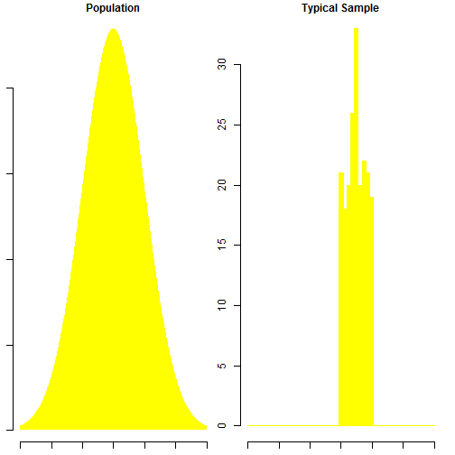

Distribution of Sample Means
========================================================
author: Daya Kiran Sunkara
date: May 24, 2015

Summary
========================================================

This application demonstrates the validity of Central Limit Theorem. Simply stated, this theorem says that for a large enough sample size n, the distribution of the sample mean will approach a normal distribution. This is true for a sample of independent random variables from any population distribution, as long as the population has a finite standard deviation.  

Dataset
========================================================

For this demonstration, we have made use of the various random distribution functions available in R.
Following distributions have been studied:

- Normal 
- Log Normal
- Exponential
- Uniform

Sample Plots
========================================================

 

Application Usage
========================================================

Following parameters can be modified using the side panel
- Distribution : The type of random distribution used.
- Sample Size : The number of points in the distribution.
- No. of repititions: The number of times the distribution needs to be generated.

Users have option to regenerate the sample distribution by clicking on the "Draw new sample" button.

Overview
========================================================

Central Limit Theorem is one of the fundamental theorems of probability theory. Through this application, we wish to ensure that the visual guide to better understand the phenomena.
