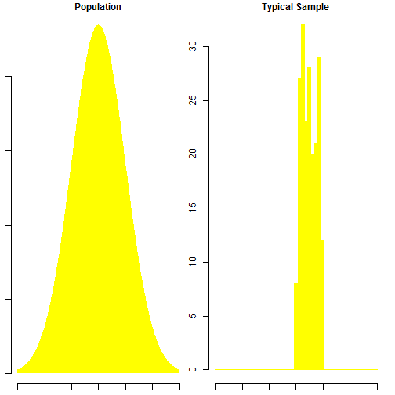

Distribution of Sample Means
========================================================
author: Daya Kiran Sunkara
date: May 24, 2015

Summary
========================================================

This application demonstrates the validity of Central Limit Theorem. Simply stated, this theorem says that for a large enough sample size n, the distribution of the sample mean will approach a normal distribution. This is true for a sample of independent random variables from any population distribution, as long as the population has a finite standard deviation.  

Dataset
========================================================

For this demonstration, we have made use of the various random distribution functions available in R.
Following distributions have been studied:

- Normal 
- Log Normal
- Exponential
- Uniform

Users can also select the following properties to generate the plot:
- Sample size
- No. of repititions.

Sample Plots
========================================================

 

Overview/Credits
========================================================

Central Limit Theorem is one of the fundamental theorems of probability theory. Through this application, we wish to ensure that the visual guide to better understand the phenomena.

Application is deployed at: 
https://dayakiran.shinyapps.io/developingdataproducts

While building this applcation, I went through various examples provided at: 
https://github.com/rstudio/shiny-examples

